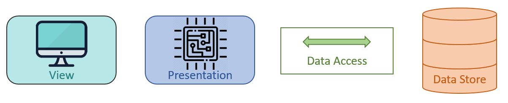
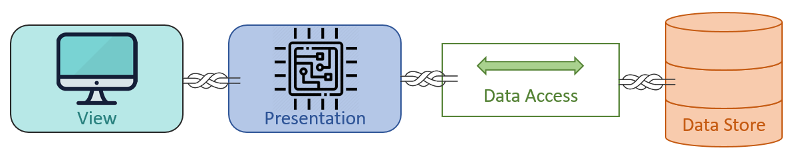
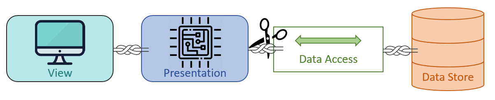
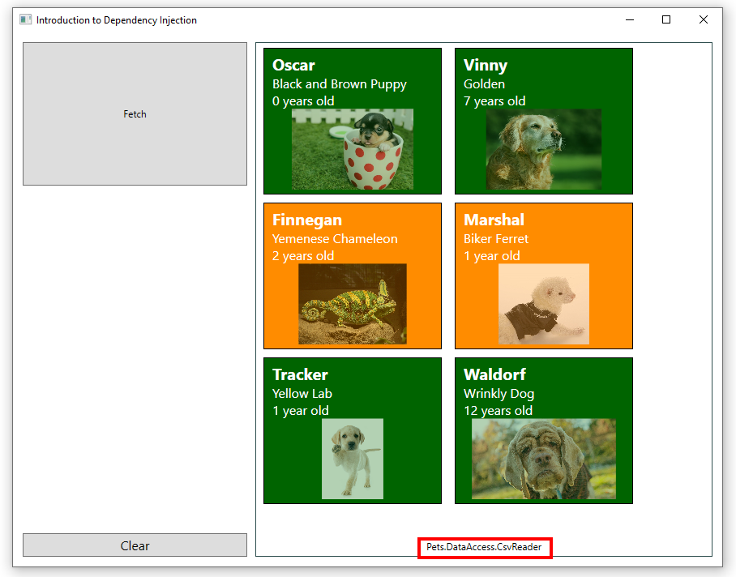
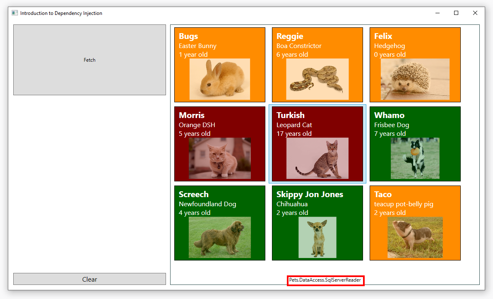

# Dependency Injection
### Speaker Notes
July 2019 - Mark Dochstader
time: ~ 45min

## Dependency Injection
Companion Repository [located here](https://github.com/handsome-b-wonderful/introduction-to-dependency-injection).

* Technique to have one object supply the dependencies of another object
* Instead of a client specifying which service it will use, something tells the client what service to use

Injection => passing in the dependency (a service) into the object (client) and joins the client state vs. having the client build or find the service

Separates the creation of a client's dependencies from the client's behavior which promotes loose coupling

__DI is a set of software design principles and patters that promote loosely coupled code__

Benefits loose coupling:
* easier to extend
* easier to test
* easier to maintain
* facilitates parallel development - less merge conflicts
* facilitates late binding

__S__.ingle Responsibility Principle

	Every module or class should have responsibility over a single part of functionality

__O__.pen/Closed Principle

	Software entities should be open for extension but closed for modification.

__L__.iskov Substitution Principle

	IS-A not adequate; Need to be SUBSTITUTABLE. Subtypes of an object must be able to replace their parent object without altering the correctness of the program

__I__.nterface Segregation Principle

	No client should have to depend on interfaces they don't use

__D__.ependency Inversion Principle

	Higher level modules can be created independently of lower-level component implementation details.

Inversion of control (IoC) is more general than DI. IoC essentially means letting other code call you rather than insisting on doing the calling. DI implements IoC through composition.

Patterns
* Constructor Injection
	* Preferred when all dependencies can be constructed first to ensure client object has a valid state.
	* Can limit some flexibility but also beneficial moving towards an immutable & thread-safe object
* Property Injection
	* freedom to manipulate state of dependencies references at any time but can cause issues * with ensuring fully injected before use
* Method Injection / Interface Injection
* Service Locator
	* central registry known as the "service locator"
	* on request returns the information necessary to perform a certain task
	* can act as a simple run-time linker. 
* Ambient Context
	* similar to service locator for a single dependency. avoid constructor bloat for things that cross-cut, like logging context

Containers
* Autofac
* Ninject
* Unity
* Castle Windsor
* Spring.NET
* ASP.NET Core built-in

## Prerequisites

* [.NET core SDK 2.2](https://dotnet.microsoft.com/download/dotnet-core/2.2)

To verify what version of dotnet you have installed use `dotnet --version` on the command line.

## Step 0 - Review the Initial Project
* View - (UI Elements)
* Presentation (View Model)  (UI Logic)
* Data Access
* Data Store

__commit__: d897d47bdcf51a1fef200bf39e0d56aabe8e053a

[01 Start Here - Baseline Application](https://github.com/handsome-b-wonderful/introduction-to-dependency-injection/tree/d897d47bdcf51a1fef200bf39e0d56aabe8e053a)




__Separation of Concerns__
* UI - View layer
* Data - Access Layer

__Tightly coupled code__
* Outside concerns

__View__

```
public PetViewerWindow()
{
	InitializeComponent();
	viewModel = new PetsViewModel();
	this.DataContext = viewModel;
}
```

* new ViewModel
	* requires compile-time reference
	* responsible for lifetime


__View Model__

```
public PetsViewModel()
{
	DataReader = new ServiceReader();
	_pets = new List<Pet>();
}
```

* new Data Reader
* determines data access technology

__Service Reader__

```
public class ServiceReader
{
	WebClient client = new WebClient();
	private string baseUri = "http://localhost:9874/api/pets";
	...
```

* new web client
	* cannot be shared


## Tight Coupling



__All coupling is not equal__

* View coupled to Data Store? bad
* Data Access Layer coupled to Data Store? maybe not...

## Why is this an issue?

Your boss says "Your new application is awesome! I just have a few changes..."
1. Not everyone uses a JSON web service; we want to support different data sources
2. We also want an *optional* client-side cache for performance

```
public PetsViewModel(string readerType)
{
	switch (readerType)
	{
		case "service":
			DataReader = new ServiceReader();
			break;
		case "service_with_cache":
			DataReader = new CachedServiceReader();
			break;
		case "csv":
			DataReader = new CsvReader();
			break;
		case "csv_with_cache":
			DataReader = new CachedCsvReader();
			break;
		case "sql":
			DataReader = new SqlReader();
			break;
		case "sql_with_cache":
			DataReader = new CachedSqlReader();
			break;
		...
```

### Violation of Single Responsibility Principle
One reason to change - right now the front end does:
* presentation logic
* picking data source
* managing lifetime
* deciding if we use a cache

3. We should add unit tests

```
[TestCase]
public void OnRefreshPetsArePopulatedTest()
{
	var vm = new PetsViewModel();
	// uh-oh => new ServiceReader() => new WebClient()
	...
```

Unit testing would require the data access service be running

How do we loosen the coupling? **Dependency Injection!**

## Step 1 - Refactor to Loosen Coupling

__commit:__ 8b27e2147fc4a81a4610f4a0439a876912ed524f

[02 Refactor to Loosen Coupling between Presentation and Data Layers](https://github.com/handsome-b-wonderful/introduction-to-dependency-injection/tree/8b27e2147fc4a81a4610f4a0439a876912ed524f)

1. Improve Abstraction (Interfaces)
2. Dictate the Service outside of the Client (Constructor Injection)
3. Focus on Object Composition (snap together pieces)

### Add an Interface



**Repository Pattern**

Mediate between the domain and data mapping layers using a collection-like interface for accessing domain objects

* Split the application from the data storage technology
* Add an interface with the repository

__CRUD Repository__

Interface Segregation Principle
* Read
* Write - not neaded

__Add__

```
using System.Collections.Generic;

namespace Pets.Common
{
    public interface IPetReader
    {
        IEnumerable<Pet> GetPets();
        Pet GetPet(int id);
    }
}
```

__Update__
```
namespace Pets.DataAccess
{
    public class ServiceReader : IPetReader
    {
    	...
```

__Update__
```
namespace Pets.Presentation
{
    public class PetsViewModel : INotifyPropertyChanged
    {
        protected IPetReader DataReader;
    	...
```

## Inject Dependencies

```
public class PetsViewModel : INotifyPropertyChanged
{
    protected IPetReader DataReader;
    private IEnumerable<Pet> _pets;

    public PetsViewModel(IPetReader dataReader)
    {
        DataReader = dataReader;
        ...
```

__Compile-time error__

```
public PetViewerWindow(PetsViewModel petsViewModel)
{
    InitializeComponent();
    viewModel = petsViewModel;
```

__Runtime error__

```
<Application x:Class="Pets.Viewer.App"
    xmlns="http://schemas.microsoft.com/winfx/2006/xaml/presentation"
    xmlns:x="http://schemas.microsoft.com/winfx/2006/xaml"
    xmlns:local="clr-namespace:Pets.Viewer"
    StartupUri="PetViewerWindow.xaml" <-- remove
    >
```

```
using Pets.DataAccess;
using Pets.Presentation;

namespace Pets.Viewer
{
    public partial class App : Application
    {
        protected override void OnStartup(StartupEventArgs e)
        {
            base.OnStartup(e);

            Compose();
            Application.Current.MainWindow.Show();
        }

        private static void Compose()
        {
            var reader = new ServiceReader();
            var viewModel = new PetsViewModel(reader);
            Application.Current.MainWindow = new PetViewerWindow(viewModel);
        }
    }
    ...
```

__Create a Startup Project__

Assembles components into an application with an entry point

* Create a Pets.Views project (WPF user controls library)
* Add references to Pets.Common and Pets.Presetation
* Move PetViewerWindow from Pets.Viewer to Pets.Views
* In Pets.Viewer add a reference to Pets.Views

## Step 2 - Implementing the Requested Changes

* add a Csv file reader
* add a SQL Server database reader
* add an optional client-side cache

### Add the Csv File Reader

Create an interface for the file loader

```
namespace Pets.DataAccess
{
    public interface ICsvFileLoader
    {
        string LoadFile();
    }
}
```

Implement the file loader

````
using System.IO;

namespace Pets.DataAccess
{
    public class CsvFileLoader : ICsvFileLoader
    {
        private readonly string _filePath;

        public CsvFileLoader(string filePath)
        {
            _filePath = filePath;
        }

        public string LoadFile()
        {
            using (var reader = new StreamReader(_filePath))
                return reader.ReadToEnd();
        }
    }
}
````

Implement a new __IPetReader__ for CSV data

````
using Pets.Common;

namespace Pets.DataAccess
{
    public class CsvReader : IPetReader
    {
        public ICsvFileLoader FileLoader { get; set; }

        ...

        public Pet GetPet(int id)
        {
            var pets = GetPets();
            return pets?.FirstOrDefault(p => p.Id == id);
        }

        public IEnumerable<Pet> GetPets()
        {
            var fileData = FileLoader.LoadFile();
            var pets = ParseData(fileData);
            return pets;
        }

       ...
    }
}
````

Restructure the application startup

````
protected override void OnStartup(StartupEventArgs e)
        {
            base.OnStartup(e);

            ComposeCsv();
            Application.Current.MainWindow.Show();
        }

        private static void ComposeCsv()
        {
            var reader = new CsvReader();
            var viewModel = new PetsViewModel(reader);
            Application.Current.MainWindow = new PetViewerWindow(viewModel);
        }

		
        private static void ComposeService()
        {
            var reader = new ServiceReader();
            ...
````

Run the application



### Add the SQL Database Reader

Add a new standard class library project __Pets.Database.csproj__ for the database repository

The example uses [NPoco](https://github.com/schotime/NPoco), a Dapper-like ORM to connect to Sql Server with the schema defined in __pets.sql__

The data repository uses a fluent mapping to populate the __Pet__ POCO in the referenced __Pets.Common__ project.

__Pets.Database/DataMappings.cs__

````
using NPoco.FluentMappings;
using Pets.Common;

namespace Pets.Database
{
    public class DataMappings : Mappings
    {
        public DataMappings()
        {
            For<Pet>().Columns(x =>
            {
                x.Column(y => y.Id).WithName("id");
                x.Column(y => y.Name).WithName("name");
                x.Column(y => y.SerialNumber).WithName("serial");
                x.Column(y => y.Age).WithName("age");
                x.Column(y => y.Category).WithName("category");
                x.Column(y => y.Description).WithName("description");
                x.Column(y => y.ImageUrl).WithName("url");
            }).PrimaryKey("id", false);
        }
    }
}
````

__Pets.Database/DataFactory.cs__

````
using System.Data.Common;
using NPoco;
using NPoco.FluentMappings;
using System.Data.SqlClient;

namespace Pets.Database
{
    public static class DataFactory
    {
        public static DatabaseFactory DbFactory { get; set; }

        public static void Setup(string connectionString)
        {
            var fluentConfig = FluentMappingConfiguration.Configure(new DataMappings());
            DbFactory = DatabaseFactory.Config(x =>
            {
                x.UsingDatabase(() =>
                    new NPoco.Database(connectionString, DatabaseType.SqlServer2012, SqlClientFactory.Instance));
                x.WithFluentConfig(fluentConfig);
            });
        }
    }
}
````

__Pets.Database/PetRepository.cs__

````
using System;
using System.Collections.Generic;
using Pets.Common;

namespace Pets.Database
{
    public class PetRepository
    {
        public static Pet Get(int id)
        {
            using (var db = DataFactory.DbFactory.GetDatabase())
                return db.SingleOrDefaultById<Pet>(id);
        }

        public static List<Pet> GetAll()
        {
            using (var db = DataFactory.DbFactory.GetDatabase())
                return db.Fetch<Pet>("");
        }
    }
}
````

Add an Sql Reader __SqlServerReader.cs__ to the DataAccess project that implements the __IPetReader__ interface

````
using System;
using System.Collections.Generic;
using System.Text;
using Pets.Common;
using Pets.Database;

namespace Pets.DataAccess
{
    public class SqlServerReader : IPetReader
    {
        public SqlServerReader(string connectionString)
        {
            DataFactory.Setup(connectionString);
        }

        public IEnumerable<Pet> GetPets()
        {
            return PetRepository.GetAll();
        }

        public Pet GetPet(int id)
        {
            return PetRepository.Get(id);
        }
    }
}
````

Add a dependency to __Pets.DataAccess__ on the __Pets.Database.csproj__ project.

Add a connection string to __Pets.Viewer/App.config__

````
    <appSettings>
      <add key="sqlServerConnectionString" value="Server=SERVER;
        Database=DATABASE;User Id=USERID;Password=PASSWORD;"/>
    </appSettings>
````

Restructure the application startup

````
protected override void OnStartup(StartupEventArgs e)
        {
            base.OnStartup(e);

            ComposeSqlServer();
            Application.Current.MainWindow.Show();
        }

        private static void ComposeSqlServer()
        {
            var reader = new SqlServerReader(ConfigurationManager.AppSettings["sqlServerConnectionString"]);
            var viewModel = new PetsViewModel(reader);
            Application.Current.MainWindow = new PetViewerWindow(viewModel);
        }

		
        private static void ComposeCsv()
        {
            var reader = new CsvReader();
            ...
````

Run the application



### Add a Client-side Cache

__Caching Data Reader__

Wraps an existing interface to add caching functionality

Create a cache

````
namespace Pets.Common
{
    public static class Caching
    {

        // USAGE:
        // int resultOfExpensiveQuery = GetObjectFromCache<int>(id, 10, CallSlowQueryFromDatabase);

        public static T GetObjectFromCache<T>(int cacheItemId, int cacheTimeInMinutes, Func<int, T> objectSetterFunction)
        {
            var cache = MemoryCache.Default;
            var cachedObject = (T)cache[cacheItemId.ToString()];
            if (cachedObject == null)
            {
                var policy = new CacheItemPolicy()
                    { AbsoluteExpiration = DateTimeOffset.Now.AddMinutes(cacheTimeInMinutes) };
                cachedObject = objectSetterFunction(cacheItemId);
                cache.Set(cacheItemId.ToString(), cachedObject, policy);
            }
            return cachedObject;
        }
    }
}
````

Create a caching reader that implements __IPetReader__

````
namespace Pets.DataAccess
{
    public class CachingReader : IPetReader
    {
        private const int cacheMinutes = 1;
        private IPetReader _baseReader;

        public CachingReader(IPetReader baseReader)
        {
            _baseReader = baseReader;
        }

        public IEnumerable<Pet> GetPets()
        {
            // we'll use -1 as the id for the entire collection
            return Caching.GetObjectFromCache(-1, cacheMinutes, _getAllPets);
        }

        public Pet GetPet(int id)
        {
            return Caching.GetObjectFromCache(id, cacheMinutes, _baseReader.GetPet);
        }

        // HACK: our cache expects the underlying retrieval method to take an id
        private IEnumerable<Pet> _getAllPets(int id)
        {
            return _baseReader.GetPets();
        }
    }
}
````

Restructure the application startup

````
    public partial class App : Application
    {
        protected override void OnStartup(StartupEventArgs e)
        {
            base.OnStartup(e);
            ComposeCachedService();
            Application.Current.MainWindow.Show();
        }

        private static void ComposeCachedService()
        {
            var baseReader = new ServiceReader();
            var cacheReader = new CachingReader(baseReader);
            var viewModel = new PetsViewModel(cacheReader);
            Application.Current.MainWindow = new PetViewerWindow(viewModel);
        }
        ...
````

* Start the Reader Service
* Run the application
* Fetch data
* Shut down the Reader Service
* Continue to Fetch/Clear until the cache expires


__Open/Close Principle__

__Liskov Substitution Principle__

Substitute a descendent class for a base class without impacting the application.


Other possible uses:
* Authorization
* Retry
* Logging


## Step 3 - Unit Testing

Isolating functionality is hard when the entire application is tightly coupled.

__Unit Testing the Presentation Layer__

* RefreshPets
* ClearPets

Create a new xUnit Test Project (.NET Core) __Pets.Presentation.Tests__

Add dependencies in test project on

*  Pets.Common
* Pets.Presentation

Create a Reader to enable isolated testing

````
using System.Collections.Generic;
using System.Linq;
using Pets.Common;

namespace Pets.Presentation.Tests
{
    public class FakeReader : IPetReader
    {
        private List<Pet> data;

        public FakeReader()
        {
            data = new List<Pet>()
            {
                new Pet() { Id = 1, Age = 1, Category = "dog", Description = "World's cutest puppy", ImageUrl = "https://cdn.psychologytoday.com/sites/default/files/styles/image-article_inline_full/public/field_blog_entry_teaser_image/puppy_0.jpg?itok=z4JZm548", Name = "Roger", SerialNumber = "pye693"},
                new Pet() {Id = 2, Age=4, Category = "cat", Description = "Grumpy Cat", ImageUrl="https://i2.wp.com/metro.co.uk/wp-content/uploads/2019/05/SEI_70586560.jpg?quality=90&strip=all&zoom=1&resize=540%2C540&ssl=1", Name="Fudge", SerialNumber = "007"},

            };
        }

        public IEnumerable<Pet> GetPets()
        {
            return data;
        }

        public Pet GetPet(int id)
        {
            return data.FirstOrDefault(p => p.Id == id);
        }
    }
}
````

Write some Unit Tests

````
using System.Linq;
using Xunit;

namespace Pets.Presentation.Tests
{
    public class PetViewModelTests
    {
        [Fact]
        public void OnRefreshPetsIsPopulated()
        {
            // arrange
            var reader = new FakeReader();
            var vm = new PetsViewModel(reader);

            // act
            vm.RefreshPets();

            // assert
            Assert.NotNull(vm.Pets);
            Assert.Equal(2, vm.Pets.Count());
        }

        [Fact]
        public void OnClearPetsIsEmpty()
        {
            // arrange
            var reader = new FakeReader();
            var vm = new PetsViewModel(reader);
            vm.RefreshPets();
            Assert.NotEmpty(vm.Pets);

            // act
            vm.ClearPets();

            // assert
            Assert.Empty(vm.Pets);
        }
    }
}
````

__Unit Testing the Csv Data Reader__

In the __CsvReader__ class we new a CsvFileLoader

````
    public class CsvReader : IPetReader
    {
        public ICsvFileLoader FileLoader { get; set; }

        public CsvReader()
        {
            ...
            FileLoader = new CsvFileLoader(filePath);
        }
````

The problem is the __FileLoader__ class contains:

````
    ...

    public string LoadFile()
        {
            using (var reader = new StreamReader(_filePath))
                return reader.ReadToEnd();
        }
````


Create a new xUnit Test Project (.NET Core) __Pets.DataAccess.Tests__

Add dependencies in test project on

*  Pets.Common
* Pets.DataAccess

Add a class to manage some test data

````
using System;

namespace Pets.DataAccess.Tests
{
    public class CsvTestData
    {
        public static string GoodData = "100,Oscar,90120,0,Dog,Black and Brown Puppy,https://images.pexels.com/photos/39317/chihuahua-dog-puppy-cute-39317.jpeg?auto=compress&cs=tinysrgb&dpr=1&w=500" + Environment.NewLine +
            "105,Waldorf,1231,12,Dog,Wrinkly Dog,https://media4.s-nbcnews.com/i/newscms/2016_52/1184388/rescue-group-old-dog-haven-today-161226-tease-01_00bac92f7fa6330b327ff47cdd4acdf2.jpg" + Environment.NewLine;

        public static string BadData = "BAD DATA" + Environment.NewLine + "MORE BAD DATA" + Environment.NewLine;

        public static string MixedData = "102,Finnegan,1239,2,Lizard,Yemenese Chameleon,https://upload.wikimedia.org/wikipedia/commons/6/68/Yemen_Chameleon.jpg" + Environment.NewLine +
            "INVALID" + Environment.NewLine +
            "104,Tracker,7363,1,Dog,Yellow Lab,https://tvar.org/wp-content/uploads/2018/04/iStock-486330501-copy.jpg" + Environment.NewLine +
            "ANOTHER INVALID" + Environment.NewLine;
    }
}
````

Add a file loader __FakeFileLoader.cs__ that removes the dependency on the file system

````
public class FakeFileLoader : ICsvFileLoader
    {
        public enum  DataQuality
        {
            Good, Bad, Mixed, Empty
        }

        private DataQuality quality;

        public FakeFileLoader(DataQuality dataQuality)
        {
            quality = dataQuality;
        }

        public string LoadFile()
        {
            switch (quality)
            {
                case DataQuality.Empty:
                    return string.Empty;
                case DataQuality.Bad:
                    return CsvTestData.BadData;
                case DataQuality.Mixed:
                    return CsvTestData.MixedData;
                default: // DataQuality.Good
                    return CsvTestData.GoodData;
            }
        }
    }
````

Write some unit tests

````
public class CsvReaderTests
    {
        [Fact]
        public void GetPetsWithGoodRecordsReturnsAllRecords()
        {
            // arrange
            var reader = new CsvReader();
            reader.FileLoader = new FakeFileLoader(FakeFileLoader.DataQuality.Good);

            // act
            var pets = reader.GetPets();

            // assert
            Assert.Equal(2, pets.Count());
        }

        [Fact]
        public void GetPetsWithNoFileThrowsException()
        {
            var reader = new CsvReader();

            Assert.Throws<FileNotFoundException>(
                () => reader.GetPets());
        }

        [Fact]
        public void GetPetsWithMixedRecordsReturnsAllRecords()
        {
            var reader = new CsvReader();
            reader.FileLoader = new FakeFileLoader(FakeFileLoader.DataQuality.Mixed);

            var pets = reader.GetPets();

            Assert.Equal(2, pets.Count());
        }

        [Fact]
        public void GetPetsWithBadRecordsReturnsEmptyList()
        {
            var reader = new CsvReader();
            reader.FileLoader = new FakeFileLoader(FakeFileLoader.DataQuality.Bad);

            var pets = reader.GetPets();

            Assert.Empty(pets);
        }

        [Fact]
        public void GetPetsWithEmptyFileReturnsEmptyList()
        {
            var reader = new CsvReader();
            reader.FileLoader = new FakeFileLoader(FakeFileLoader.DataQuality.Empty);

            var pets = reader.GetPets();

            Assert.Empty(pets);
        }
    }
````

Property Injection is good when

 * We want the default behaviour most of the time
 * We don't know all the dependencies when the consumer is created
 * We want the flexibility to override the default behaviour

## Summary

Dependency Injection promotes loose coupling

This makes it easier to

* Extend
* Test
* Maintain
* Develop in Parallel
* Utilize Late Binding (Reflection or a DI Framework)

Encourages SOLID principles

Multiple Patterns for Dependency Injection

Next Steps

* Dependency Injection Containers
* Lifetime management
* Injecting string and other primitives
* Interception
* Additional Patterns (Null Object, Proxy, Composite)
